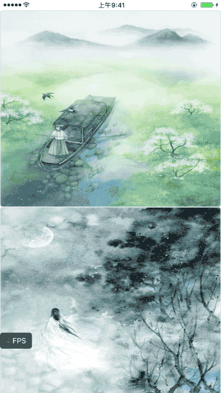

# AYYFPSIndicator
Simple FPS Indicator
FPS = Frames Per Second ,
每秒显示帧数 - 帧率测量单位,详情请参阅 [FPS 维基百科](https://zh.wikipedia.org/wiki/帧率)
### 使用方法
请在 DEBUG 模式下使用 FPS 监控
##### 1. 默认位置显示 FPS 值
```objc
- (BOOL)application:(UIApplication *)application didFinishLaunchingWithOptions:(NSDictionary *)launchOptions {
    // Override point for customization after application launch.
    
#ifdef DEBUG
    // 1. 默认位置开启 FPS 监听,可拖动
    [[AYYFPSIndicator sharedInstance] start];
#endif
    return YES;
}
``` 




##### 2. statusBar 显示 FPS值
```objc
- (BOOL)application:(UIApplication *)application didFinishLaunchingWithOptions:(NSDictionary *)launchOptions {
    // Override point for customization after application launch.
    
#ifdef DEBUG
    // 2. 在 statusBar 显示 FPS
    [[AYYFPSIndicator sharedInstance] start];
    [AYYFPSIndicator sharedInstance].indicatorPosition = AYYFPSIndicatorPositionStatusBar;
#endif
    return YES;
}
``` 


### 参阅
[iOS-Core-Animation-Advanced-Techniques](https://github.com/AttackOnDobby/iOS-Core-Animation-Advanced-Techniques)    
[YYFPSLabel](https://github.com/ibireme/YYKit/blob/master/Demo/YYKitDemo/YYFPSLabel.m)   
[WWFPSIndicator](https://github.com/Tidusww/WWFPSIndicator)


